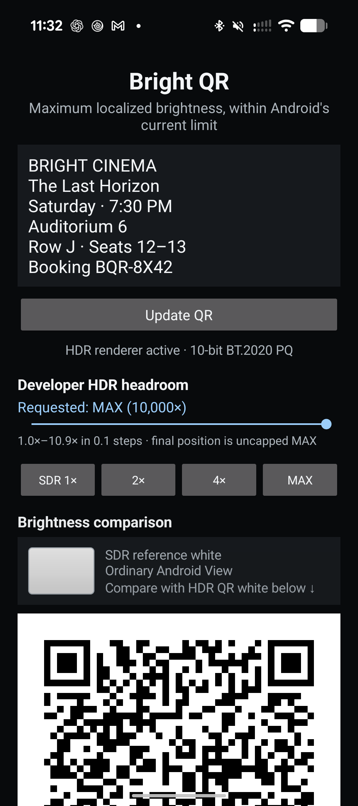
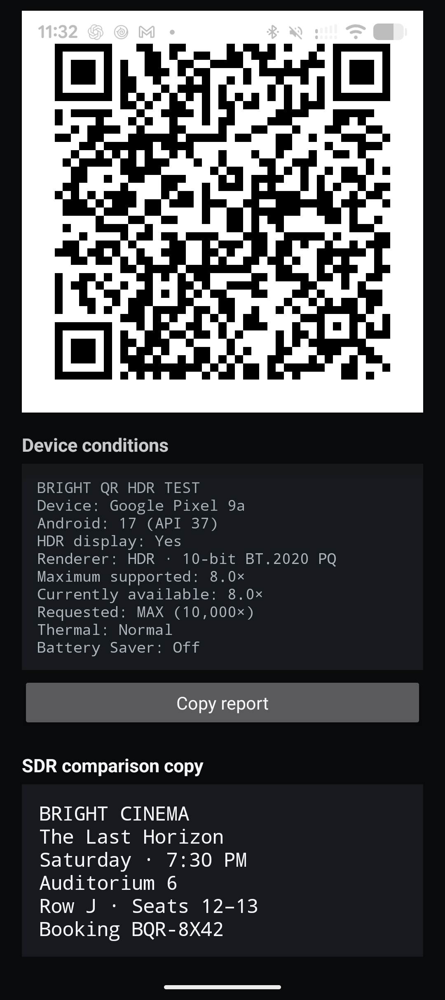
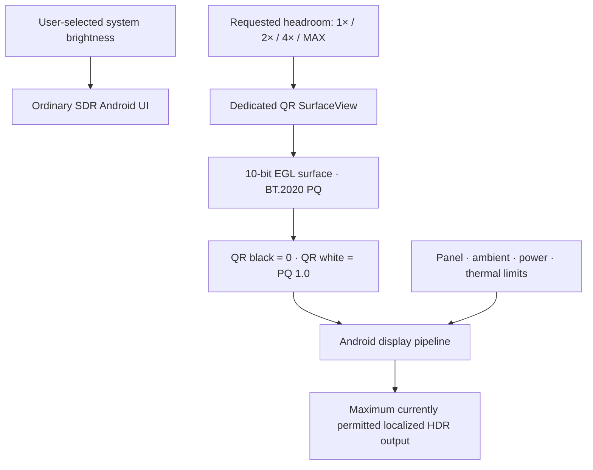

# Bright QR

Bright QR is a native Android demonstration of localized HDR brightness. It keeps
the ordinary app interface at the user's normal SDR brightness while rendering a
QR code in a dedicated 10-bit BT.2020 PQ `SurfaceView` and requesting all HDR
headroom Android currently permits.

The goal is deliberately narrow:

> Make QR white as bright as Android allows on the phone running the app, without
> raising the brightness of the surrounding interface.

This repository contains the complete Android project, a developer headroom dial,
repeatable brightness presets, an SDR-white reference, live device diagnostics,
copyable test reports, light/dark themes, and a realistic movie-seat QR payload.

## Screenshots

<p align="center">
  
  
</p>

These are ordinary SDR screenshots. They confirm layout and state, but cannot
reproduce the physical luminance difference between the SDR interface and HDR QR
white. That difference must be observed on an HDR-capable display.

## What the demo proves

At low ordinary screen brightness, Bright QR can leave the editor, labels, and
movie ticket copy dim while the QR's white modules use the display's available HDR
range. On the Pixel 9a used for the screenshots, Android reported:

```text
Renderer:             HDR · 10-bit BT.2020 PQ
Maximum supported:    8.0×
Currently available:  8.0×
Requested:            MAX (10,000×)
Thermal:              Normal
Battery Saver:        Off
```

`10,000×` is an intentionally oversized request, not expected output. It is the
largest value accepted by Android 15's API. Android remains responsible for
clamping the request according to the display, ambient conditions, bit depth,
power policy, and thermal state.

## Features

- **Maximum-output policy:** requests `10_000f` HDR headroom on Android 15 and
  newer so the application does not impose an artificial 2× or 4× ceiling.
- **Real HDR pixels:** renders through a 10-bit RGBA EGL config tagged as BT.2020
  PQ rather than placing ordinary SDR white on a bright window.
- **Peak PQ white:** QR white uses PQ code value `1.0`, the ST 2084 10,000-nit
  mastering endpoint; Android maps or clips it to current output capability.
- **Repeatable presets:** `SDR 1×`, `2×`, `4×`, and `MAX` buttons synchronize with
  the developer dial.
- **Fine tuning:** the dial provides 0.1× steps from 1.0× through 10.9×, followed
  by a final uncapped `MAX` position.
- **SDR reference:** a normal white Android `View` sits immediately above the HDR
  QR for a direct visual comparison.
- **Live diagnostics:** shows device, Android version, HDR support, renderer,
  maximum/current/requested ratios, thermal status, and Battery Saver state.
- **Copyable reports:** one tap copies the current device report for comparisons
  across phones.
- **Realistic content:** includes editable movie, auditorium, row, seat, and
  booking data rather than a placeholder URL.
- **System light/dark mode:** follows Android's system theme with explicit day and
  night palettes and matching system-bar icon contrast.
- **Edge-to-edge safe:** respects status bars, navigation bars, and display cutouts
  on modern Android releases.
- **Scrollable layout:** remains usable on compact devices and with larger font
  settings.
- **No brightness override:** never assigns
  `WindowManager.LayoutParams.screenBrightness`; ordinary UI brightness remains
  under user and system control.
- **Graceful fallback:** uses a standard SDR EGL surface when the required HDR path
  is unavailable.

## How it works



The brightness request and pixel encoding are separate requirements:

1. `HdrQrSurfaceView` calls `setDesiredHdrHeadroom(...)` on API 35+.
2. `HdrEglState` chooses an exact 10/10/10/2 EGL config and creates the window
   surface with `EGL_GL_COLORSPACE_BT2020_PQ_EXT`.
3. `QrRenderer` draws absolute black and PQ endpoint white into that surface.
4. Android's compositor maps the HDR content to the headroom currently available.
5. `DisplayDiagnostics` observes delivered HDR/SDR ratio changes and reports
   thermal and power conditions that may affect the result.

Merely requesting headroom would not make SDR-white pixels HDR. Conversely,
encoding HDR pixels without the surface request would leave Android free to choose
a lower headroom policy. Bright QR deliberately does both.

## Android compatibility

| Android version | API | Behavior |
| --- | ---: | --- |
| Android 8–13 | 26–33 | HDR PQ rendering where the device/EGL stack supports it; no ratio telemetry or explicit surface-headroom control |
| Android 14 | 34 | Adds live `Display.getHdrSdrRatio()` reporting |
| Android 15 | 35 | Adds `SurfaceView.setDesiredHdrHeadroom()` and enables the dial/presets/MAX policy |
| Android 16+ | 36+ | Adds highest-possible ratio reporting through `Display.getHighestHdrSdrRatio()` |

The project compiles against Android SDK 35. The Android 16 diagnostic is queried
compatibly at runtime so SDK 36 is not required to build the project.

## Requirements

- Android Studio or command-line Android SDK
- Android SDK Platform 35
- JDK 17 or newer
- An Android 8.0+ device for installation
- An HDR-capable Android 15+ phone for the complete maximum-headroom demo

The Gradle wrapper and Android Gradle Plugin configuration are included.

## Build

Clone the repository and run:

```shell
git clone https://github.com/loudsun1997/bright-qr.git
cd bright-qr
./gradlew test lintDebug assembleDebug
```

The APK is generated at:

```text
app/build/outputs/apk/debug/app-debug.apk
```

Install it on a connected device:

```shell
adb install -r app/build/outputs/apk/debug/app-debug.apk
adb shell am start -n dev.brightqr/.MainActivity
```

## Wireless debugging

Wireless ADB is available on Android 11 and newer.

1. Put the computer and phone on the same Wi-Fi network.
2. On the phone, enable **Developer options → Wireless debugging**.
3. Open **Pair device with pairing code**.
4. Pair using the temporary pairing address:

   ```shell
   adb pair PHONE_IP:PAIRING_PORT
   ```

5. Enter the six-digit code displayed by Android.
6. Return to the main Wireless debugging screen and use its separate connection
   port:

   ```shell
   adb connect PHONE_IP:DEBUGGING_PORT
   adb devices -l
   ```

Pairing and connection ports are usually different and may rotate after sleep or
after Wireless debugging is toggled. If a paired phone disappears, discover its
current connection service with:

```shell
adb mdns services
```

## Suggested demo script

1. Use an HDR-capable Android 15+ phone.
2. Turn off **Extra dim** and Battery Saver.
3. Keep the phone cool and set normal screen brightness fairly low.
4. Open Bright QR and confirm `HDR · 10-bit BT.2020 PQ` in Device conditions.
5. Compare the ordinary SDR-white swatch with the QR's white modules.
6. Tap **SDR 1×** and observe the QR return toward ordinary white.
7. Tap **2×**, then **4×**, and watch `Currently available` update.
8. Tap **MAX** and compare again with the SDR reference and ticket copy.
9. Scan the movie-seat QR using a second phone.
10. Tap **Copy report** and save the result for cross-device comparison.

Actual output can change while the demo is running. Android documents that HDR
headroom is subject to factors such as ambient conditions, panel capability, and
bit-depth limitations. Thermal and power states can introduce additional limits.

## Developer controls

### Presets

| Preset | Surface request | Intended use |
| --- | ---: | --- |
| SDR 1× | `1.0f` | Baseline comparison; requests no HDR headroom |
| 2× | `2.0f` | Moderate HDR lift |
| 4× | `4.0f` | Strong lift on capable displays |
| MAX | `10_000f` | Requests everything Android currently permits |

### Fine-control dial

Dial positions 0–99 map to 1.0×–10.9× in 0.1× increments. Position 100 maps to
the explicit 10,000× MAX request. This keeps common phone ratios easy to tune while
retaining the uncapped policy at the end of the control.

Moving the dial changes requested headroom, not absolute luminance. Two phones may
produce very different physical output from the same requested ratio.

## Test report

The report is generated from public Android APIs and resembles:

```text
BRIGHT QR HDR TEST
Device: Google Pixel 9a
Android: 17 (API 37)
HDR display: Yes
Renderer: HDR · 10-bit BT.2020 PQ
Maximum supported: 8.0×
Currently available: 8.0×
Requested: MAX (10,000×)
Thermal: Normal
Battery Saver: Off
```

The report intentionally uses ratios rather than claiming measured nits. A phone's
advertised peak luminance is not proof of the luminance delivered for a particular
frame under current conditions.

## Project structure

```text
app/src/main/java/dev/brightqr/
├── MainActivity.java          Scrollable demo UI, presets, report copy, themes
├── HdrQrSurfaceView.java      Surface lifecycle and desired-headroom policy
├── HdrEglState.java           Exact EGL config selection and PQ surface tagging
├── QrRenderer.java            OpenGL QR renderer and PQ endpoint output
├── QrCodeGenerator.java       ZXing QR generation with quiet zone
├── DisplayDiagnostics.java    Ratio, renderer, thermal, and power reporting
└── HdrPolicy.java             MAX policy and developer-dial mapping

app/src/test/java/dev/brightqr/
├── HdrPolicyTest.java
├── QrCodeGeneratorTest.java
└── DisplayDiagnosticsTest.java
```

The application is intentionally implemented with platform Android views and a
small OpenGL ES 2 renderer. ZXing Core is the only application dependency.

## Validation

Run the complete local verification suite with:

```shell
./gradlew clean lintDebug test assembleDebug
```

The repository currently passes:

- Debug and release JVM unit tests
- Android lint with no issues
- Clean debug APK assembly
- Physical Pixel 9a launch and QR rendering
- 10-bit BT.2020 PQ renderer activation
- Live 8.0× requested/delivered ratio verification
- Wireless install and launch through ADB

Unit tests cover:

- MAX headroom constant
- PQ endpoint constant
- Fine-dial ratio mapping and MAX endpoint
- QR payload validation and quiet-zone generation
- Thermal status labeling

## Troubleshooting

### The app reports `SDR fallback`

The phone or EGL implementation did not expose the required 10-bit BT.2020 PQ
surface path. Check that the built-in display advertises HDR support and that HDR
has not been disabled in system settings.

### `Currently available` stays at `1.0×`

- Confirm the phone is running Android 14+ and supports ratio reporting.
- Confirm the renderer says `HDR · 10-bit BT.2020 PQ`.
- Turn off Battery Saver and Extra dim.
- Try a brighter ambient environment if adaptive brightness is enabled.
- Let the phone cool if thermal status is elevated.
- Return the developer control to MAX.

### Wireless ADB pairing succeeds but connection fails

Use the pairing port only with `adb pair`. Then use the connection port shown on
the parent Wireless debugging screen with `adb connect`. Run `adb mdns services`
to locate a rotated connection port.

### A screenshot does not look brighter

Screenshots contain pixel values, not the panel's emitted luminance. Android may
also tone-map HDR content into the SDR screenshot. Judge the effect on the physical
phone or with appropriate luminance-measurement equipment.

## Privacy and permissions

Bright QR:

- requests no camera, location, storage, account, or network permission;
- makes no network requests;
- does not upload QR payloads or diagnostics;
- does not persist entered ticket text;
- writes to the clipboard only after **Copy report** is tapped; and
- uses `FLAG_KEEP_SCREEN_ON` only while the activity is visible.

## Important limitations

- The app can request maximum localized brightness; it cannot force the panel's
  absolute advertised peak.
- Output is controlled by Android and device firmware, not only by the app.
- Ratios are relative to the current SDR white point, not universal nits.
- Large HDR regions may be constrained differently from small highlights.
- OLED power limits, ambient-light policy, Battery Saver, and thermal throttling
  can reduce available output.
- Static bright content can contribute to temporary image retention or long-term
  display wear. Avoid leaving the QR at MAX unnecessarily.

## References

- [SurfaceView.setDesiredHdrHeadroom](https://developer.android.com/reference/android/view/SurfaceView#setDesiredHdrHeadroom(float))
- [Display HDR/SDR ratio APIs](https://developer.android.com/reference/android/view/Display)
- [Android 15 HDR headroom control](https://developer.android.com/about/versions/15/features#hdr-headroom-control)
- [Android thermal APIs](https://developer.android.com/reference/android/os/PowerManager)
- [Android color management](https://source.android.com/docs/core/display/color-mgmt)
